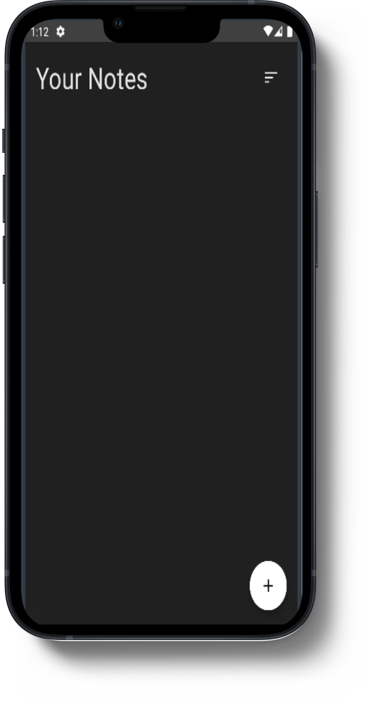
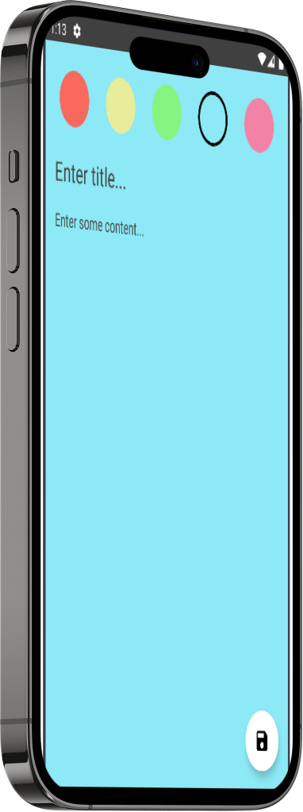
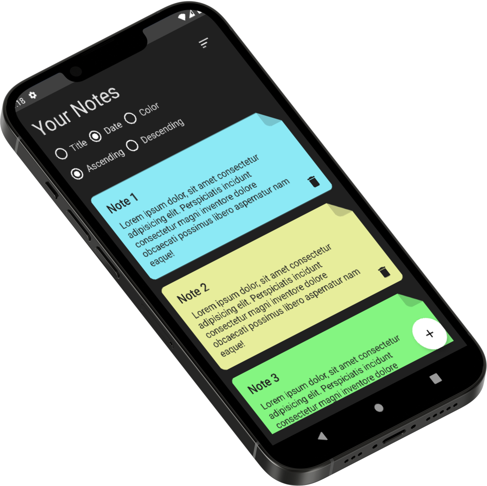

# NoteApp
Note App is an Android note-taking application developed with Jetpack Compose, MVVM architecture, and Room Database. 
It offers a feature-rich experience for users to create, organize, and manage their notes efficiently.

## App Preview

## Features:
- Create and organize your notes effortlessly.
- Sort notes by date, color, or title in ascending or descending order.
- Customize your notes with various colors to make them stand out.
- Edit and update notes with ease.
- Delete notes securely and even undo deletions.
- Keep your notes organized and never forget a thing!

## Acknowledge

In This App i used:
- Jetpack Compose for the design
- RoomDatabase for Local database 
- MVVM architecture pattern
- Use Cases

## Contributing

1. Fork it (<https://github.com/tokhy1/NoteApp.git/fork>)
2. Create your feature branch (`git checkout -b feature/fooBar`)
3. Commit your changes (`git commit -am 'Add some fooBar'`)
4. Push to the branch (`git push origin feature/fooBar`)
5. Create a new Pull Request

## Contact 
- Email: <mohamed21346587@gmail.com>
- LinkedIn: [LinkedIn Profile](https://www.linkedin.com/in/mohamed-ashraf-abd-elmoneam-409538246?lipi=urn%3Ali%3Apage%3Ad_flagship3_profile_view_base_contact_details%3BgLq%2BPh0QQX62Mwzt3ozQGQ%3D%3D)

Happy Coding!
